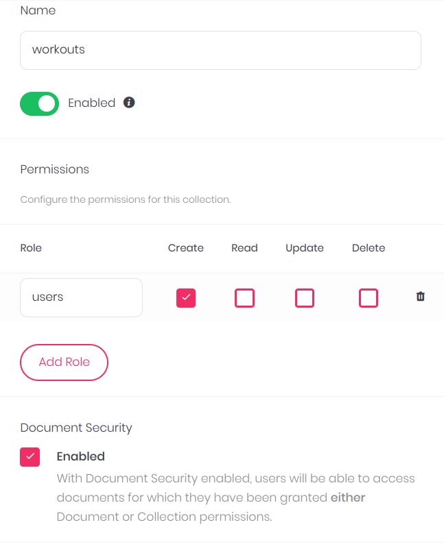

# 🔖 Workout Buddy

A simple app to store your workout routines. Made with Nuxt 3 and Appwrite.

## Screenshots of the App

<p align="center">

</p>

<p align="center">

</p>

<p align="center">

</p>

## 🎬 Getting Started

### 🤘 Install Appwrite

Follow the simple [Installation Guide](https://appwrite.io/docs/installation) to get Appwrite up and running in no time. You can either deploy Appwrite on your local machine or, on any cloud provider of your choice.

> Note: If you setup Appwrite on your local machine, you will need to create a public IP so that your hosted frontend can access it.

We need to make a few configuration changes to your Appwrite server.

1. Add a new Web App in Appwrite and enter the endpoint of your website (`localhost, <project-name>.vercel.app etc`)
   

2. Create a new database, and then a new collection with the following properties.

- **Attributes**
  Add the following attributes to the collection.
  > Make sure that your Attribute ID exactly matches the key in the images

<p align="center">

</p>

<p align="center">

</p>

<p align="center">

</p>

<p align="center">

</p>

<p align="center">

</p>

- **Permissions**
  Add the following permissions to your collection. These permissions ensure that only registered users can access the collection.

<p align="center">

</p>

### 🚀 Deploy the Front End

You have two options to deploy the front-end and we will cover both of them here. In either case, you will need to fill in these environment variables that help your frontend connect to Appwrite.

- NUXT_APP_ENDPOINT - Your Appwrite endpoint
- NUXT_APP_PROJECT - Your Appwrite project ID
- NUXT_APP_COLLECTION_ID - Your Appwrite collection ID
- NUXT_APP_DATABASE_ID - Your Appwrite database ID

### **Deploy to a Static Hosting Provider**

You can deploy to your favourite hosting providers, including Vercel, Netlify and DigitalOcean. You will need to enter the environment variables above when prompted.

> Note: Vercel is unable to auto detect the framework so please use the Vue Framework in case of vercel.

### **Run locally**

Follow these instructions to run the demo app locally

```sh
$ git clone https://github.com/EshaanAgg/workout-buddy
$ cd workout-buddy
```

Run the following command to generate your `.env` vars

```sh
$ cp .env.example .env
```

Now fill in the envrionment variables we discussed above in your `.env`

Now run the following commands and you should be good to go 💪🏼

```
$ npm install
$ npm run dev
```
